# 2022/2023

Kurz **Programování na Nuselské** bude probíhat od 15. září 2022
a volně navazuje na kurz **začátečníci**. Je určen pro děti druhých
až čtvrtých tříd libovolné základní školy s tím, že děti druhých
tříd musí mít absolvovaný kurz začátečníci, šikovní jedinci z
řad třetích či čtvrtých tříd mohou přijít i bez předchozího
vzdělání.

Cílem tohoto kurzu je pokračování v rozvoji systematického
myšlení, hlubší poznávání světa informační techniky
a osvojení si základů elektrotechniky.

Kurz bude probíhat 1x týdně, každý čtvrtek od 14:15 do 15:05
v počítačové učebně.

V kurzu budeme využívat robůtky [Cubetto](https://www.primotoys.com),
[Beebot](https://www.bee-bot.us/) i [Ozobot](https://ozobot.com/).
Později si představíme platformu [Micro:bit](https://microbit.org)
a s ní zabředneme trochu blíže k elektrotechnice. Kromě těchto
se budeme věnovat i práci na PC, kde se budeme učit programovat
pomocí vybraných kurzů na [code.org](https://www.code.org),
prostředí [scratch](https://scratch.mit.edu/) a dalších.
To vše proložíme tvůrčími aktivitami s papírem, kostkami a jinými
rekvizitami.

Cílem kurzu není vzdělat hotového programátora, ale rozvíjet logické
myšlení, algoritmizaci a jiné vlastnosti, které se dětem budou hodit
při studiu jakéhokoliv oboru.

Kurz bude organizován a veden [Lukášem Doktorem](../../lectors/ldoktor.md)

## 1. hodina

<a href="pokrocili-1-01-beeboti.jpg">
    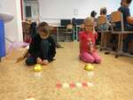
</a>

* Stránky [www.code.org](https://www.code.org)
  * Speedrun kurzu B
* Beeboti a Cubetto
  * Vytváření příběhu s Beeboty po skupinkách
  * Domácí úkol - připravit si převlek na Beebota na následující hodinu [odkaz](https://blog.tts-group.co.uk/wp-content/uploads/2019/03/Bee-Bot_Jacket.pdf)

## 2. hodina

<a href="pokrocili-1-02-beeboti2.jpg">
    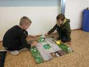
</a>
<a href="pokrocili-1-02-beeboti1.jpg">
    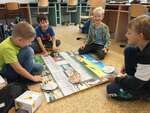
</a>

* Beeboti
  * Komentované příběhy s beeboty ve vlastnoručně vyrobených převlecích
  * Hra kouknu a vidím
* Stránky [www.code.org](https://www.code.org)
  * Speedrun kurzu B

## 3. hodina

<a href="pokrocili-1-03-cykly.jpg">
    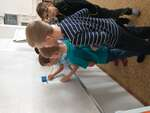
</a>

* Stránky [www.code.org](https://www.code.org)
  * Opakování cyklů na tabuli a s písničkou
  * Pokračování v kurzu B
* Domácí úkol
  * Opravite "Pseudo-kód pro počítač" v receptu [[pdf](pokrocili-1-04-peceni.pdf), [odt](pokrocili-1-04-peceni.odt)]
za pomocí opakování, viz. ukázka v prvních dvou krocích.
  * Volitelně se můžete pokusit dort upéci. Který návod Vám vyhovoval nejvíce?

## 4. hodina

<a href="pokrocili-1-04-dort.jpg">
    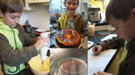
</a>

* Kontrola a projdutí domácího úkolu [[pdf](pokrocili-1-04-peceni.pdf), [odt](pokrocili-1-04-peceni.odt)]
* Stránky [www.code.org](https://www.code.org)
  * Bláznění s cykly a Cykly se Sklízečem

## 5. hodina

* Cubetto
  * Opakování pohybu po mapě, určení polohy dle řádků a sloupců (A3, B4, ...) a natočení dle světových stran (N - North - sever,
    S - South - jih, W - West - západ, E - East - východ)
  * Soutěž v pohybu po mapě
* Stránky [www.code.org](https://www.code.org)
  * Pokračování v kurzu B

## 6. hodina

<a href="pokrocili-1-06-rr.jpg">
    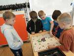
</a>

* Ricochet Robots
  * Logická deskovka s roboty
* Tvorba "dopisu pro Ježíška" v [gimpu](https://www.gimp.org/)
  * Spuštění grafického editoru GIMP
  * Hledání obrázků na internetu
  * Kopírování obrázků z prohlížeče do programu GIMP (kvůli právům nefunguje drag-n-drop, proto v prohlížeči využíváme pravé tlačítko myši na obrázku a "kopírovat obrázek", následně v GIMPu "úpravy->vložit jako->Nová vrstva")
  * Domácí úkol - rozmyslet si, co bychom rádi dostali (obrázky) a jak o to pěkně Ježíška poprosit (text)

## 7. hodina

* Tvorba "dopisu pro Ježíška" v [gimpu](https://www.gimp.org/)
  * Vysvětlení konceptu vrstev
  * Kopirování obrázků z internetu, změna velikosti a přesun vrstev

## 8. hodina

<a href="pokrocili-1-08-rozvrzeni-obrazku.jpg">
    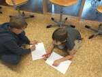
</a>

* Tvorba "dopisu pro Ježíška" v [gimpu](https://www.gimp.org/)
  * Přibližování a oddalování plochy pomocí `ctrl+kolečko myši`
  * Mazání, vyplňování plochy barvou, přechodem a štětcem
  * Označování pomocí `ctrl+a`, čtverce, elipsy a volného výběru; nástroje kreslí pouze v označeném prostoru

## 9. hodina

<a href="pokrocili-1-09-jezisek4.jpg">
    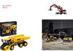
</a>
<a href="pokrocili-1-09-jezisek3.jpg">
    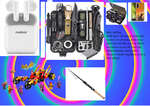
</a>

<a href="pokrocili-1-09-jezisek.jpg">
    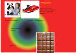
</a>

* Tvorba "dopisu pro Ježíška" v [gimpu](https://www.gimp.org/)
  * Tvorba textu (pozor na barvu - neviditělný text)
  * Dokončení dopisu

## 10. hodina

<a href="pokrocili-1-10-microbit.jpg">
    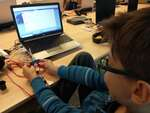
</a>

* [Micro:bit](../microbit)
  * Seznámení s Micro:bitem, jaké má vstupy, jaké výstupy, který "šváb" je zodpovědný za co, kde je anténa, ...
  * Seznámení s prostředím makecode, základními kategoriemi a hlavně způsobem uploadu programu do Micro:bitu
  * Zobrazování různých obrázků na integrovaném 5x5 ledkovém displeji, reakce na tlačítka A, B, A+B, piny 0, 1, 2 a zatřesení

## 11. hodina

<a href="pokrocili-1-11-koledy.jpg">
    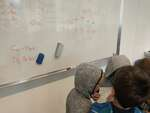
</a>

* Seznámení s notovou osnovou, výškou a délkou not
* [Micro:bit](../microbit)
  * Předvedení koledy [Jak jsi krásné neviňátko](https://makecode.microbit.org/_a3JUJCECsT4k)
  * Tvorba vlastní koledy (transformace dat z notového zápisu do formátu makecode)

## 12. hodina

* [Micro:bit](../microbit)
  * Tvorba vlastní koledy (transformace dat z notového zápisu do formátu makecode) [pomůcka](../2019_2022/2019-11-koledy.pdf)
  * Připojení externího reproduktoru pomocí "krokosvorek"

## 13. hodina

* Vysavač
  * Ukázka vnitřností rozbitého vysavače a naznačení možnosti opravy
  * Komutátorový motor, mikročip, zesilovač, kondenzátory, rezistory, ...
* [Micro:bit](../microbit)
  * Projekt ``Sfoukni svíčku``

## 14. hodina

<a href="pokrocili-1-14-pocitac.jpg">
    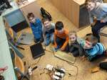
</a>

* Sestavování počítače
  * Co to je počítač, monitor, periferie
  * Rozebrání a sestavení počítače
    * základní deska
    * zdroj (230V na 3.3V, 5V, 12V)
    * procesor (umí počítat a řídit)
    * rychlá dočasná paměť RAM (ramka)
    * pomalá trvalá paměť HDD (pevný disk)
    * grafická karta (umí pracovat s vektory, malovat, ...)
    * monitor (hloupé zařízení které zobrazí přesně to, co mu grafická karta řekne)
    * klávesnice, myš (joystick, volant, skákací podložka, čtečka čipových karet, ...)
  * Spuštění počítače pomocí šroubováku
  * Rozebrání pevného disku HDD, ukázání principu (magnetický kotouček, hlavička se vystaví na pozici a přečte jestli je zmagnetován kladně či záporně)

## 15. hodina

* [Micro:bit](../microbit)
  * 2 skupiny vytvářely projekty ve ``Wonder Building Kitu`` (kolotoč a automatické autíčko), 1 skupinka v ``Groove shieldu`` (blik, alarm, bezdrátový metr)

## 16. hodina

<a href="pokrocili-1-16-microbit3.jpg">
    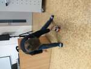
</a>
<a href="pokrocili-1-16-microbit2.jpg">
    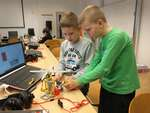
</a>
<a href="pokrocili-1-16-microbit.jpg">
    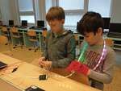
</a>

* [Micro:bit](../microbit)
  * ``Wonder Building Kit`` skupinky pokračovaly ve svých projektech (kolotoč a automatické autíčko) a  ``Grove shield`` skupinka si hrála s LED páskem (různé varianty duhy)

## 17. hodina

<a href="pokrocili-2-01-microbit.jpg">
    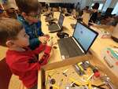
</a>

* [Micro:bit](../microbit)
  * ``Wonder Building Kit`` skupinky vytvářeli robotickou ruku a motorku, ``Grove shield`` skupinka ovládala LED diodu a připravila si skokometr

## 18. hodina

<a href="pokrocili-2-02-microbit2.jpg">
    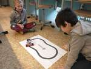
</a>
<a href="pokrocili-2-02-microbit.jpg">
    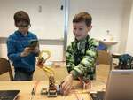
</a>

* [Micro:bit](../microbit)
  * Robotická ruka, autíčko sledující čáru a několikero projektů ve stavebnici Grove

## 19. hodina

<a href="pokrocili-2-03-microbit.jpg">
    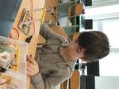
</a>

* [Micro:bit](../microbit)
  * Pokračování s ``Wonder Building Kit`` (Chodící Yeti, basketbalový koš a robotická ruka)

## 20. hodina

<a href="pokrocili-2-04-microbit.jpg">
    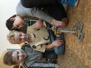
</a>

* [Micro:bit](../microbit)
  * Pokračování s ``Wonder Building Kit`` (Chodící Yeti, basketbalový koš a vysokozdvižný vozík)

## 21. hodina

<a href="pokrocili-2-05-microbit.jpg">
    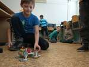
</a>

* [Micro:bit](../microbit)
  * Pokračování s ``Wonder Building Kit`` (Chodící Yeti s detekcí překážky, robotický pes a vysokozdvižný vozík)

## 22. hodina

<a href="pokrocili-2-06-historie.jpg">
    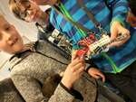
</a>

* Historie PC
  * Praktická ukázka historického kalkulátoru Zeta
    * Popis funkce
    * Ukázka principu pomocí stavebnice Lego
  * Povídání s otázky za ceny ohledně historie výpočetní techniky ([drawio](../assets/historie-pocitacu.drawio), [svg](../assets/historie-pocitacu.drawio.svg))

## 23. hodina

* [Scratch](https://scratch.mit.edu)
  * [Motivační ukázka hry předchozích studentů](https://scratch.mit.edu/projects/499965964/)
  * Přihlášení ke společnému účtu a seznámení s prostředím
  * Pridávání postaviček/spritů, scén/pozadí
  * Tabíky se scénářem/kódem, kostýmy a zvuky
  * Něco málo o událostech

## 24. hodina

* [Scratch](https://scratch.mit.edu)
  * Základy psaní scénářů/kódu
  * Každá postava/pozadí má vlastní kód
  * Vše musí začínat událostí

## 25. hodina

* [Scratch](https://scratch.mit.edu)
  * První jednoduchá hra - chytni kočku
  * Rozdělení kódu na několik samostatných bloků, pro každý účel nový, (téměř) všechny začínají zelenou vlaječkou
  * Nekonečná smyčka - opakuj navždy - zpravidla v kombinaci s bločkem "čekej", který udává, jak často se činnost vykoná.

## 26. hodina

<a href="zacatecnici-2-10-scratch2.jpg">
    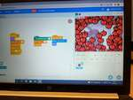
</a>

* [Scratch](https://scratch.mit.edu)
  * Vyzkoušeli jsme si tvorbu "klonů", neboli instancí naší postavy, na jednoduché hře s kamerou
  * Pro generování neznámého/nekonečného počtu nepřátel či bonusů se ve Scratchi používá klonování postavy
    * Vytvoříme jednu postavu, zpravidla ji skryjeme a vytvoříme nekonečný cykl, kde použitím "klonuj (sebe)" vytváříme
 své kopie
    * Při vytvoření klonu se spustí událost "když startuje můj klon", kterou lze použít k přemístění, zobrazení, uprave
ní, ... toho konkrétního klonu
    * Jednotlivé klony můžeme zrušit pomocí funkce "zruš tento klon"
    * Při spuštění hry se všechny předchozí vytvoření klony zruší a zůstane pouze původní postava
  * Rozšíření s kamerou je potřeba přidat pomocí tlačítka v levo dole "Přidej rozšíření" a vybereme "Vnímání videa"
    * Krátká vsuvka o bezpečnosti na internetu a sdílení kamery
    * Toto rozšíření obsahuje bločky "při pohybu na videu > (10)", které se spustí, pokud změněná plocha pod tímto konkrétním objektem je větší, než naše hodnota (100 == komplet celá plocha postavy se musí změnit, 50 == plocha pod polovinou postavy, 10 == stačí postavu pouze pošťouchnout :D)
  * Užili jsme si legraci s chytáním ovoce/sladkostí/srdíček/objektů

## 27. hodina

* [Scratch](https://scratch.mit.edu)
  * Začli jsme vyvíjet hru "chytání padajícího ovoce". Detaily s návodem ve formátech: [pdf](../2020_2021/pokrocili-2-01-chytani-ovoce-v2.pdf) či [odt](../2020_2021/pokrocili-2-01-chytani-ovoce-v2.odt)
  * V první části jsme paňáčka naučili chodit. Nejprve pomocí události od klávesnice, poté pomocí neustálého dotazování na stav (polling)
  * [Odkaz na část 1](https://scratch.mit.edu/projects/839986097/)

## 28. hodina

* [Scratch](https://scratch.mit.edu)
  * Tentokráte jsme se věnovali padajícímu ovoci. Náš sprit jsme schovali, poté pomocí nekonečné smyčky a "klonuj (sebe)" začali ve vhodném intervalu vytvářet nekonečné množství instancí a zobrazovali je.
  Detaily s návodem ve formátech: [pdf](../2020_2021/pokrocili-2-01-chytani-ovoce-v2.pdf) či [odt](../2020_2021/pokrocili-2-01-chytani-ovoce-v2.odt)

## 29. hodina

<a href="pokrocili-2-13-robotemil2.jpg">
    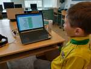
</a>

* Testovací hodina [Robota Emila](https://www.h-edu.cz/informatika)
  * Dostali jsme možnost vyzkoušet beta-verzi Robota Emila; děti si zkoušely úkoly dle libosti, ve dvojicích diskutoval
y rozdíly a na závěr představily nejoblíbenější zadání

## 30. hodina

* [Scratch](https://scratch.mit.edu)
  * Použili jsme <a href="https://scratch.mit.edu/projects/499965964/">vytvořenou část 3</a> jako základ a upravili ji k obrazu svému.
  * Někdo přetvořil hlavní postavu, jiný upravil zvukové projevy, další se zaměřil na padající ovoce a někdo dokonce prohodil podmínky hry tak, že místo sbírání ovoce se musel vyhybat padajícím objektům, případně kombinace (vyhnout se některým objektům a jiné sbírat)

## 31. hodina

* Stránky [www.code.org](https://www.code.org)
  * Dokončení kurzu "B"

## 32. hodina

<a href="pokrocili-2-16-minetest2.jpg">
    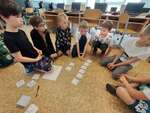
</a>

* [Minetest](https://www.minetest.net/)
  * Minetest je hra inspirovaná Minecraftem ale kompletně open-source s velkým množstvím rozšířeních a k dispozici zdarma. Základní hra nabídne několik druhů bločků a nic moc navíc, proto doporučuji kliknout dole v menu "+" (Instalovat hry z ContentDB) a přidat rozšíření jako třeba "MineClone 2", jež je dost podobné Minecraftu. Nebo pouze přidat "Mobs Redo", jež přidává do hry tvory/zvířata (pokud nechcete nebezpečné tvory, je možné použít přidat "only_peaceful_mobs = true" do konfiguračního souboru "minetest.conf", čímž se nepřidají nestvůry, ale pouze hodná zvířata). Hra samozřejmě umožňuje více hráčů buď lokálně, nebo po síti (podobně jak v Minecraftu).
  * My jsme využili tuto hru k nastínění agilní metodologie řízení projektů. Děti dostali za úkol [vytvořit vesnici dle zadaných požadavků](../assets/minetest-vesnice.pdf). Pro zjednodušení a zrychlení dostaly úkoly sprintu připravené. Následně si braly jednoduché úkoly a na konci sprintu (po setmění) jsme zhodnotili a naplánovali další.

