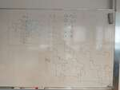

# 2022/2023

Kurz **Programování na Nuselské** bude probíhat od 15. září 2022
a volně navazuje na kurz **začátečníci**. Je určen pro děti druhých
až čtvrtých tříd libovolné základní školy s tím, že děti druhých
tříd musí mít absolvovaný kurz začátečníci, šikovní jedinci z
řad třetích či čtvrtých tříd mohou přijít i bez předchozího
vzdělání.

Cílem tohoto kurzu je pokračování v rozvoji systematického
myšlení, hlubší poznávání světa informační techniky
a osvojení si základů elektrotechniky.

Kurz bude probíhat 1x týdně, každý čtvrtek od 15:15 do 16:05
v počítačové učebně.

V kurzu budeme využívat robůtky [Cubetto](https://www.primotoys.com),
[Beebot](https://www.bee-bot.us/) i [Ozobot](https://ozobot.com/).
Později si představíme platformu [Micro:bit](https://microbit.org)
a s ní zabředneme trochu blíže k elektrotechnice. Kromě těchto
se budeme věnovat i práci na PC, kde se budeme učit programovat
pomocí vybraných kurzů na [code.org](https://www.code.org),
prostředí [scratch](https://scratch.mit.edu/) a dalších.
To vše proložíme tvůrčími aktivitami s papírem, kostkami a jinými
rekvizitami.

Cílem kurzu není vzdělat hotového programátora, ale rozvíjet logické
myšlení, algoritmizaci a jiné vlastnosti, které se dětem budou hodit
při studiu jakéhokoliv oboru.

Kurz bude organizován a veden [Lukášem Doktorem](../../lectors/ldoktor.md)

## 1. hodina

* Historická vložka
  * Mechanismus z Antikythéry, Pascalina, tkalcovský stav, sálové počítače, PC
* Stránky [www.code.org](https://www.code.org)
  * Speedrun začátku kurzu C
* [Twinery](https://twinery.org)
  * Ukázka tree-ware gamebooku - "O Norikovi"
  * Ukázka interaktivního příběhu [O né tak úplně červené Karkulce](../twinery/karkulka.html)
  * Domácí úkol - přemýšlet o vlastním interaktivním příběhu, který si v následující hodině pokusíme zpracovat

## 2. hodina

* [Twinery](https://twinery.org)
  * Seznámení s prostředím
  * Tvorba základní kostry příběhu

## 3. hodina

* [Twinery](https://twinery.org)
  * Pokračování v tvorbě kostry příběhu
  * Lehký úvod do proměnných

## 4. hodina

* [Twinery](https://twinery.org)
  * Ukázkové projekty: [O né tak úplně červené Karkulce](../twinery/karkulka.html) a [Ostrov](../twinery/Ostrov.html)
  * [Návod na twinery](../twinery/Jak na twinery.html)

## 5. hodina

* [Twinery](https://twinery.org)
  * Použití podmínek:

        (if: $podmínka)[Vše v těchto závorkách se zobrazí pouze pokud je podmínka splněna]\
        (else:)[Vše v těchto závorkách se zobrazí pouze pokud podmínka splněna není]

  * Zakončení práce s Twinery. Pro pokračování doma využijte [Návod na twinery](../twinery/Jak na twinery.html)
    návody na internetu, nebo výše poskytnuté ukázky. Případné otázky rád zodpovím v hodinách a návod případně
    aktualizuji.

## 6. hodina

* Konfigurace vlastního počítače z komponent
  * Vyzkoušeli jsme si "naskládat do košíku" komponenty na funkční počítač a porovnat cenu/výkon
  * Děti mohly použít jakýkoliv internetový obchod, např: [czc](www.czc.cz), [alza](www.alza.cz) a [softcom](www.softcom.cz)
  * Hlavní komponenty: procesor, základní deska, grafická karta, operační paměť, pevný disk, bedna a zdroj
  * Doplňkové komponenty: monitor, klávesnice, myš
  * Cena: do 25000kč
  * Porovnání výkonu: [userbenchmark](https://www.userbenchmark.com/PCBuilder)
  * Cílem hodiny bylo vyzkoušení orientace v e-shopu, vytvoření kompletního PC které teoreticky může fungovat, balancování výkonu a ceny jednotlivých komponent

## 7. hodina

* Algoritmy
  * [Pěkné video vysvětlující co to jsou algoritmy](https://www.youtube.com/watch?v=HsO2reAF0IA)
  * Seřazení žáků dle výšky bez poheldu na celé pole (žák stojí zády a ptá se na 2 pozice, dozví se pouze který z žáků na těchto pozicích je větší)
  * Předvedení základních třídících algoritmů a jejich diagramů [pdf](sort.pdf), [odg](sort.odg)
  * Seznámení s pojmem největší společný dělitel, příště si vyzkoušíme jeho hledání pomocí Euklidova algoritmu [pdf](gcd.pdf), [odg](gcd.odg) a ukážeme si rozdíl mezi algoritmem, programem a strojovým kódem [pdf](gcd-disassembly.pdf), [odt](gcd-disassembly.odt)
  * Do budoucna doporučuji schovat si odkaz na pěknou literaturu [zde](https://knihy.nic.cz/files/edice/pruvodce_labyrintem_algoritmu.pdf)

## 8. hodina

* Algoritmy
  * Zopakování třídícího algoritmu [pdf](sort.pdf), [odg](sort.odg)
  * Euklidův algorimus pro výpočet největšího společného dělitele [pdf](gcd.pdf), [odg](gcd.odg)
  * Názorná ukázka rozdílu mezi algoritmem, programem, strojovým kódem a programem uloženým na disku [pdf](gcd-disassembly.pdf), [odt](gcd-disassembly.odt)
* [Makecode arcade](https://arcade.makecode.com/)
  * Seznámení s platformou

## 9. hodina

* [MakeCode Arcade](https://arcade.makecode.com)
  * Vyzkoušeli jsme [motivační hru](https://makecode.com/_Txf6iT1H4MHC)
  * Vysvětlili jsme si, jak si na Youtube zapnout titulky a změnit jejich jazyk na "Automatický překlad->Čeština"
  * Děti si prošly první tři videa z [pěkného návodu na tvorbu her v makecode arcade](https://www.youtube.com/watch?v=MGbKModdYiI&list=PL7Z0B3syVHmCdo7Jha2AXnC8YaolrvaMF&index=1)

## 10. hodina

* [MakeCode Arcade](https://arcade.makecode.com)
  * Pokračování v [návodu](https://www.youtube.com/watch?v=MGbKModdYiI&list=PL7Z0B3syVHmCdo7Jha2AXnC8YaolrvaMF&index=1) cca 3. - 5. část

## 11. hodina

* Ukázka "vykuchané" řídící jednotky kotle a ovladače (relátka, diody, rezistory, kondenzátory, transformátory, pojistka, integrované obvody, ...)
* [MakeCode Arcade](https://arcade.makecode.com)
  * Pokračování v [návodu](https://www.youtube.com/watch?v=MGbKModdYiI&list=PL7Z0B3syVHmCdo7Jha2AXnC8YaolrvaMF&index=1) cca 3. - 5. část

## 12. hodina

* [MakeCode Arcade](https://arcade.makecode.com)
  * Pokračování v [návodu](https://www.youtube.com/watch?v=MGbKModdYiI&list=PL7Z0B3syVHmCdo7Jha2AXnC8YaolrvaMF&index=1) cca 4. - 6. část

## 13. hodina

* Vysavač
  * Ukázka vnitřností rozbitého vysavače a naznačení možnosti opravy
  * Komutátorový motor, mikročip, zesilovač, kondenzátory, rezistory, ...
* [MakeCode Arcade](https://arcade.makecode.com)
  * Pokračování v [návodu](https://www.youtube.com/watch?v=MGbKModdYiI&list=PL7Z0B3syVHmCdo7Jha2AXnC8YaolrvaMF&index=1) cca 5. - 7. část

## 14. hodina

* Sestavování počítače
  * Opakování z čeho se počítač skládá, k čemu to slouží a jak je to pospojované
    * základní deska
    * zdroj (230V na 3.3V, 5V, 12V)
    * procesor (umí počítat a řídit)
    * rychlá dočasná paměť RAM (ramka)
    * pomalá trvalá paměť HDD (pevný disk)
    * grafická karta (umí pracovat s vektory, malovat, ...)
    * monitor (hloupé zařízení které zobrazí přesně to, co mu grafická karta řekne)
    * klávesnice, myš (joystick, volant, skákací podložka, čtečka čipových karet, ...)
  * Seznámili jsme se s:
    * časováním a násobičem procesorové frekvence - procesor běží násobně rychleji než periferie, zeptá se na data a následně si počítá, co chce, až jsou data k dispozici, načte si je
    * dvoukanálovým řadičem RAM (dual-channel) - pokud jsou k dispozici 2 kompatibilní paměti, procesor se střídavě dotazuje jedné a druhé, čímž přibližně zdvojnásobí rychlost odezvy (pokud potřebuje data uložená v obou pamětích)
    * přetaktováním (overclocking)
      * Test 2.66GHz procesoru při 2.8GHz a následně se zvýšeným napětím na 3.0GHz
      * Frekvence procesoru ovlivňuje frekvenci periferií (800MHz RAM se zvedlo na 880MHz)
      * Přetaktování zvyšuje odpadní teplo a může vést k nenávratnému poškození počítače!
      * Nestihli jsme si pustit videa o extrémním přetaktováním, ukážeme si (části) příště [video zde](https://www.youtube.com/watch?v=rdLJu9AQOng) [a jiné tu](https://www.youtube.com/watch?v=FnwhYEUHw7k)

## 15. hodina

* [MakeCode Arcade](https://arcade.makecode.com)
  * Dokončení [návodu](https://www.youtube.com/watch?v=MGbKModdYiI&list=PL7Z0B3syVHmCdo7Jha2AXnC8YaolrvaMF&index=1) do konce 7. části
  * [Project1](https://makecode.com/_Cii6Co85oJ38)
  * [Project2](https://makecode.com/_5yqUcY8PAKmA)
  * [Project3](https://makecode.com/_18Vdqe8Lpa8f)
  * [Project4](https://makecode.com/_2kJ4fpFgwbLY) ([oprava](https://makecode.com/_T7Ue5aHc0bks))

## 16. hodina

* [MakeCode Arcade](https://arcade.makecode.com)
  * Předělání hry z předchozích hodin na hru "přecházení silnice", čímž jsme si shrnuli učivo a zároveň si ukázali, jak malý je rozdíl mezi poměrně odlišnými hrami.

## 17. hodina

* [MakeCode Arcade](https://arcade.makecode.com)
  * Dokončení předělávek, hry se dětem moc povedly.

## 18. hodina

* Učení
  * Přehled možností a pomůcek k efektivnímu učení - [paměťová mapa s příklady](../assets/uceni.png)
  * Moje soukromá doporučení
    * Vymyslete si 3-5 věcí, které byste rádi zrealizovali do 5 let (dlouhodobý plán)
    * Rozložte si tyto plány na jednoduché kroky, které vedou směrem k dosažení těchto cílů (krátkodobé plány)
    * Vyzkoušejte "mikromeditaci" před učením (soustřeďte se pouze na jeden smysl, např. zrak, sluch, čich, dotek...); zpočátku 2 - 5 minut, až se naučíte, stačí 10 - 20s
    * Pro záznam myšlenek vyzkoušejte paměťovou mapu (mindmapu) [inspirace](../assets/uceni.png)
    * Pro výuku něco == něco využijte kartičky či software na výuku pomocí kartiček (doporučuji [Anki](https://apps.ankiweb.net/) či na androidu [Ankidroid](https://play.google.com/store/apps/details?id=com.ichi2.anki))
    * Pro výuku cizých jazyků vyzkoušejte videa s titulky, učte se slovní spojení místo jednotlivých slovíček

## 19. hodina

* [Micro:bit](../microbit)
  * Seznámení s Micro:bitem
  * Připomenutí makecode prostředí pomocí jednoduchých projektů, např. "skokometr"

## 20. hodina

* [Micro:bit](../microbit)
  * Kostka
    * Zobrazit čísla pomocí teček
    * Podvádění
* Libreoffice Calc (Excel)
  * Ověření náhodnosti kostky pomocí grafu
  * Sloupec A - hody
  * Sloupec C - přípustné hodnoty (1, 2, 3, 4, 5, 6)
  * Sloupec D - počet výskytů - funkce ``=FREQUENCY(A:A;C2:C7)`` (vložení pomocí ctrl+shift+enter)
  * Označit sloupec D a kliknout na ikonku "Vložit graf" (případně označit osu Y a nastavit min = 0)
  * [Výsledek ve formátu ods (libreoffice)](../assets/statistika-hody-kostkou.ods) [pdf verze jen pro čtení](../assets/statistika-hody-kostkou.pdf)

## 21. hodina

* [Micro:bit](../microbit)
  * Dopilování podvodů v kostce
  * Hra "Hasiči POZOR"
    * Ověření náhodnosti kostky
    * 2x6 - zpět na start
    * Podezdřelé sekvence - výměna za klasickou kostku
    * Nejlepší podvodník vyhrává :-)

## 22. hodina

* Historie PC
  * Praktická ukázka historického kalkulátoru Zeta
    * Popis funkce
    * Ukázka principu pomocí stavebnice Lego
  * Povídání s otázky za ceny ohledn# historie výpo#etní techniky ([drawio](../assets/historie-pocitacu.drawio), [svg](../assets/historie-pocitacu.drawio.svg))

## 23. hodina

* [Micro:bit](../microbit)
  * Seznámení s ``Wonder Building Kitem``

## 24. hodina

* [Micro:bit](../microbit)
  * Tvorba modelů (hardware) a jejich programování (software) ze stavebnice ``Wonder Building Kit``

## 25. hodina

* [Micro:bit](../microbit)
  * Pokračování se stavebnicí ``Wonder Building Kit``
  * Pro ovládání robotické ruky jsme přidali ``Waweshark`` joystick. Zde bylo zapotřebí definovat komunikační protokol. Využili jsme funkce ``odešli hodnotu NAME číslo VALUE`` a ``spustit kód když je přijata hodnota (jméno číslo) NAME VALUE``, pojmenovali jsme si jednotlivé osy ``A, B, C`` a definovali hodnotu jako číslo od 0 do 1023. Přijímací strana následně upravuje tyto hodnoty (0 až 1023) buďto na rychlost otáčení motoru (-100 až 100), nebo na polohu serva (0 až 359) pomocí bločku ``mapuj HODNOTU z intervalu od NIZKA do VYSOKA do intervalu od NIZKA do VYSOKA``
    * 0 se namapuje na -100, resp. 0
    * 512 se namapuje na 0, resp. 180
    * 1023 se namapuje na 100, resp. 359

## 26. hodina

* Umělé inteligence
  * UI není inteligentní bytost, jedná se o nástroj jako je lopata. Při vhodném použití výrazně usnadní práci, ale člověk musí vědět, co od ní chce (nemusí už ale nezbytně vědět, co přesně, na druhou stranu musí výsledky dobře zkontrolovat)
  * Přirovnání k dynamitu - Alfred Nobel jej vynalezl jako spolehlivou a bezpečnou důlní trhavinu, nicméně okamžitě byl využit pro vojenské účely, což jej zdrtilo. Jako omluvu zřídil fond, který uděluje Nobelovu cenu.
  * Podobně novější UI modely jsou úžasné nástroje, které dokáží velmi pomoci, ale na druhé straně velmi snadno i uškodit. Trošku jsme toto téma s dětmi probrali, aby si byly vědomi možných následků i benefitů.
  * Praktická zkušenost - děti se připojili k ChatGPT, vyzkoušeli si, co umí, že se také umí plést ale že dovede generovat perzonifikované texty i programy (např. pohádky na míru, ukázky programů pro microbit, ...)

## 27. hodina

* [Micro:bit](../microbit)
  * Pokračování se stavebnicí ``Wonder Building Kit``
  * Řešili jsme jak transformovat 2-osy joysticku ``x=<0; 1023> y=<0; 1023>`` na rychlost otáčení motorů autíčka ``L=<-100; 100> P=<-100; 100>``. Nakreslili jsme si x, y do osy a vyzkoušeli pouze řešení v ose x (``L=x, P=x``) a y (``L=y, P=-y``), poté jsme výsledek spojili (``L=x+y, P=x-y``) a vysvětlili si, jaké potíže nám způsobí "nasycení", čili stav kdy jedeme rychle a zároveň zatáčíme (``L=150, P=50``). Můžeme buď omezit maximální rychlost (``L=0.5x+0.5y, P=0.5x-0.5y``) a získat konzistentní ovládání, nebo zachovat maximální rychlost a smířit se s nekonzistentním zatáčením při vyšších rychlostech (případně zvolit složitější algoritmy pro plynulejší přechod)

## 28. hodina

* [Micro:bit](../microbit)
  * Pokračování se stavebnicí ``Wonder Building Kit``
  * Dokončili jsme vozidlo sledující čáru, autíčko na ovládání a, pomocí senzoru vzdálenosti, upravili jsme jeřáb na jednoduchý hudební nástroj.

## 29. hodina

* Předávání instrukcí - malování obrázků
  * Děti se pokusily předat co nejpřesněji instrukce partnerům bez možnosti zpětné vazby. Toto cvičení nám ukazuje, kolik věcí si domýšlí lidský mozek, když nemá přesná data, případně nestíhá data zpracovat. Také nám ukazuje, kolik dat se ztratí při transformaci myšlenky na slova u prvního žáka, při přenosu zvuku, při zpracování slov u žáka druhého a nakonec při transformaci myšlenky na papír. Co říkám není to, co myslím a co slyším, nemusí být to, co druhý říká.
  * Počítač, narozdíl od člověka, nemá možnost si data domyslet, pokud jej k tomu nikdo nenaprogramuje, proto je důležité trénovat přesný popis (například orientace papíru, rozměry kreslených objektů, přesné umístění...)
  * Toho lze docílit například rozdělením plochy na malé čtverečky a uložení konkrétní hodnoty barvy (rasterový obrázek). Alternativní možností je uložit každý tah (čáru) jako vektor a rekonstruovat obraz (vektorový obrázek). Každý způsob má své výhody.

## 30. hodina

* Bezpečí na internetu
  * Jako úvod jsme diskutovali nad tématem, kdo vlastně platí vytvářený obsah na internetu.
  * Následně jsme využili komix [Contra Chrome](https://contrachrome.com/comic/cz01/) jako odrazový můstek k tématu soukromí, sběru dat a cílené reklamy
  * A poté si vyzkoušeli [pěknou hru od jsns](https://onlinekurzy.jsns.cz/#!/play/6) na téme dezinformace.
  * Někteří stihli ještě lehký úvod do [Deep Fake](https://www.youtube.com/watch?v=Wrald_EZgDQ) videí
  * Myšlenka dne: Nelze se vyhnout sběru dat, je potřeba jej přijmout ale dobře volit co sdílíme, co potřebujeme a co si můžeme odpustit. Je důležité přemýšlet u toho, co děláme, co vidíme. Také je důležité si uvědomit, že na internetu je ke každé informaci mnoho zdrojů pravdivých i mnoho nepravdivých a tudíž pořekadlo "Na každém šprochu pravdy trochu" na internetu nemusí platit.

## 31. hodina

* Optimalizace, úzké hrdlo, konstrukce a návaznost výrobních linek
  * Využili jsme hry [Shapezio](https://shapez.io/) k názorné ukázce, jak stavět optimální konstrukce, co to je úzké hrdlo, jak se projevuje a jak spočítat optimální poměr jednotlivých komponent.

## 32. hodina

* [Minetest](https://www.minetest.net/)
  * Minetest je hra inspirovaná Minecraftem ale kompletně open-source s velkým množstvím rozšířeních a k dispozici zdarma. Základní hra nabídne několik druhů bločků a nic moc navíc, proto doporučuji kliknout dole v menu "+" (Instalovat hry z ContentDB) a přidat rozšíření jako třeba "MineClone 2", jež je dost podobné Minecraftu. Nebo pouze přidat "Mobs Redo", jež přidává do hry tvory/zvířata (pokud nechcete nebezpečné tvory, je možné použít přidat "only_peaceful_mobs = true" do konfiguračního souboru "minetest.conf", čímž se nepřidají nestvůry, ale pouze hodná zvířata). Hra samozřejmě umožňuje více hráčů buď lokálně, nebo po síti (podobně jak v Minecraftu).
  * My jsme využili tuto hru k nastínění agilní metodologie řízení projektů. Děti dostali za úkol [vytvořit vesnici dle zadaných požadavků](../assets/minetest-vesnice.pdf). Pro zjednodušení a zrychlení dostaly úkoly sprintu připravené. Následně si braly jednoduché úkoly a na konci sprintu (po setmění) jsme zhodnotili a naplánovali další.

