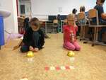
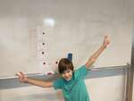
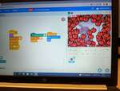

# 2022/2023

Kurz **Programování na Nuselské** bude probíhat od 15. září 2022
a je určen pro děti prvních[1](#footnote1) a druhých
tříd dětí z libovolných škol. Cílem těchto kurzů je rozvíjení
přirozené touhy dětí po poznávání okolního světa s důrazem na
techniku a rozvoj systematického myšlení.

Kurz bude probíhat 1x týdně každý čtvrtek od 13:15 do 14:05 v počítačové
učebně.

V kurzu budeme využívat robůtky [Cubetto](https://www.primotoys.com),
[Beebot](https://www.bee-bot.us/) i [Ozobot](https://ozobot.com/).
Zároveň se budeme věnovat i práci na PC pomocí open source aplikace
[GCompris](https://gcompris.net) a začneme kurzy z platformy
[code.org](https://[www.code.org](https://www.code.org)). Pro zpestření budou kurzy provázeny
tvůrčími aktivitami s papírem, kostkami a jinými rekvizitami.

Cílem kurzu není vzdělat hotového programátora, ale rozvíjet logické
myšlení, algoritmizaci a jiné vlastnosti, které se dětem budou hodit
při studiu jakéhokoliv oboru.

Kurz bude organizován a veden [Lukášem Doktorem](../lectors/ldoktor)

## 1. hodina

* Beeboti
  * Pohyb vpřed a vzad
* Stránky [www.code.org](https://www.code.org)
  * Nastavení účtu
  * Bludiště s Angry birds

## 2. hodina

* Beeboti
  * Otočení a pohyb v prostoru
* Stránky [www.code.org](https://www.code.org)
  * Bludiště s Angry birds

## 3. hodina

* Stránky [www.code.org](https://www.code.org)
  * Programování ve sklízeči

## 4. hodina

* Stránky [www.code.org](https://www.code.org)
  * Programování ve sklízeči a začátek Bláznění s cykly
  * Písnička <a href="https://studio.code.org/s/course1/lessons/12/levels/1">Getting Loopy</a>

## 5. hodina

* Cubetto
  * Robůtek podobný Beebotům
  * Program se skládá z bločků, je přímo vidět a snadno se upravuje
  * Orientace na mapě
    * Pozice daná písmenem (sloupec) číslem (řada), např. A3, B6, D1
    * Natočení určeno směrovými stranami - N = North (Sever), S = South (Jih), W = West (Západ), E = East (Východ)
    * Přesná poloha vyžaduje pozici a natočení, např. A3N, B1E, ...
  * Soutěž o hodnotné ceny - pohyb po mapě

## 6. hodina

* Cubetto
  * Pokračování pohybu po mapě
  * Inverzní úloha (najdi start při zadaném programu a cíli)
* Ricochet Robots
  * Logická deskovka s roboty

## 7. hodina

* Stránky [www.code.org](https://www.code.org)
  * Sklízeč a bláznění s cykly

## 8. hodina

* [Robomise](https://www.robomise.cz)
  * L1 a L2
* Za odměnu tématická hra [přistání na měsíci](http://moonlander.seb.ly/)

## 9. hodina

* [Robomise](https://www.robomise.cz)
  * L2 a L3
* Za odměnu tématická hra [SkyRoads](https://archive.org/details/SkyRoads)

## 10. hodina

* [Robomise](https://www.robomise.cz)
  * L2 - L5
* Za odměnu tématická hra [SkyRoads](https://archive.org/details/SkyRoads)

## 11. hodina

* Organizace mikulášské nadílky
  * Definice úloh
  * Návaznosti úloh, možnosti paralelního zpracování a přidělování úkolů
  * Vlastní tvorba

## 12. hodina

* Organizace mikulášské nadílky
  * Opakování návaznosti úloh a možností paralelního zpracování
  * Vlastní tvorba a programování robotů

## 13. hodina

* Vysavač
  * Ukázka vnitřností rozbitého vysavače a naznačení možnosti opravy
  * Komutátorový motor, mikročip, zesilovač, kondenzátory, rezistory, ...
* Kniha ``Můj první počítač``
  * Historie, části PC, použití
  * Fyzická ukázka relé, tranzistoru, jednoduchého IC, procesoru
* Za odměnu [adventní kalendář](https://decko.ceskatelevize.cz/advent) od české televize

## 14. hodina

* Sestavování počítače
  * Co to je počítač, monitor, periferie
  * Rozebrání a sestavení počítače
    * základní deska
    * zdroj (230V na 3.3V, 5V, 12V)
    * procesor (umí počítat a řídit)
    * rychlá dočasná paměť RAM (ramka)
    * pomalá trvalá paměť HDD (pevný disk)
    * grafická karta (umí pracovat s vektory, malovat, ...)
    * monitor (hloupé zařízení které zobrazí přesně to, co mu grafická karta řekne)
    * klávesnice, myš (joystick, volant, skákací podložka, čtečka čipových karet, ...)
  * Spuštění počítače pomocí šroubováku
  * Rozebrání pevného disku HDD, ukázání principu (magnetický kotouček, hlavička se vystaví na pozici a přečte jestli je zmagnetován kladně či záporně)

## 15. hodina

* Lehký úvod do elektroniky
  * Seznámením s tím, co to elektřina vlastně je [pěkné video zde](https://www.youtube.com/watch?v=mc979OhitAg)
  * [Teslův transformátor](https://cs.wikipedia.org/wiki/Tesl%C5%AFv_transform%C3%A1tor)
    * malinký transformátor z Aliexpresu
    * sériové zapojení baterií (3x6x1.2V)
    * vytahování oblouku pomocí klíčů
    * přehrávání hudby pomocí jiskření
    * rozsvěcení úsporných žárovek, diod a tlumivek
* Stavebnice Boffin
  * Představení stavebnice Boffin a první zapojení

## 16. hodina

* Lehký úvod do elektroniky
  * [Co to je napětí](https://www.youtube.com/watch?v=w82aSjLuD_8&list=PLWv9VM947MKjuqlJVp5m_Edf66SrFSHx2&index=2)
* Stavebnice Boffin
  * Různá zapojení (sériové, paralelní, vliv polarity, ...)

## 17. hodina

* Stavebnice Boffin
  * Různá zapojení (nestabilní zesilovač, míchání barev při rotaci, ...)

## 18. hodina

* Stavebnice Boffin
  * Stavba AM rádia a vysílače
  * Stavba FM rádia (nefungovalo)
  * Hra - zopakuj sekvenci

## 19. hodina

* Stránky [www.code.org](https://www.code.org)
  * Procvičování cyklů
* Beeboti
  * Seznámení nově příchozích s Beeboty

## 20. hodina

* Stránky [www.code.org](https://www.code.org)
  * Procvičování cyklů
* Ti kdo splnili zkoušeli [čipkovanou](https://www.umimeinformatiku.cz/sipkovana)

## 21. hodina

* Události
  * Vysvětlení pojmu událost a interaktivní aplikace
  * Programátorské pexeso
* Stránky [www.code.org](https://www.code.org)
  * Game-lab (programování s událostmi)

## 22. hodina

* Historie PC
  * Praktická ukázka historického kalkulátoru Zeta
    * Popis funkce
    * Ukázka principu pomocí stavebnice Lego
  * Povídání s otázky za ceny ohledně historie výpočetní techniky ([drawio](../assets/historie-pocitacu.drawio), [svg](../assets/historie-pocitacu.drawio.svg))

## 23. hodina

* [Scratch](https://scratch.mit.edu)
  * [Motivační ukázka hry předchozích studentů](https://scratch.mit.edu/projects/499965964/)
  * Přihlášení ke společnému účtu a seznámení s prostředím
  * Pridávání postaviček/spritů, scén/pozadí
  * Tabíky se scénářem/kódem, kostýmy a zvuky
  * Něco málo o událostech

## 24. hodina

* [Scratch](https://scratch.mit.edu)
  * Základy psaní scénářů/kódu
  * Každá postava/pozadí má vlastní kód
  * Vše musí začínat událostí

## 25. hodina

* [Scratch](https://scratch.mit.edu)
  * První jednoduchá hra - chytni kočku
  * Rozdělení kódu na několik samostatných bloků, pro každý účel nový, (téměř) všechny začínají zelenou vlaječkou
  * Nekonečná smyčka - opakuj navždy - zpravidla v kombinaci s bločkem "čekej", který udává, jak často se činnost vykoná.

## 26. hodina

* [Scratch](https://scratch.mit.edu)
  * Vyzkoušeli jsme si tvorbu "klonů", neboli instancí naší postavy, na jednoduché hře s kamerou
  * Pro generování neznámého/nekonečného počtu nepřátel či bonusů se ve Scratchi používá klonování postavy
    * Vytvoříme jednu postavu, zpravidla ji skryjeme a vytvoříme nekonečný cykl, kde použitím "klonuj (sebe)" vytváříme své kopie
    * Při vytvoření klonu se spustí událost "když startuje můj klon", kterou lze použít k přemístění, zobrazení, upravení, ... toho konkrétního klonu
    * Jednotlivé klony můžeme zrušit pomocí funkce "zruš tento klon"
    * Při spuštění hry se všechny předchozí vytvoření klony zruší a zůstane pouze původní postava
  * Rozšíření s kamerou je potřeba přidat pomocí tlačítka v levo dole "Přidej rozšíření" a vybereme "Vnímání videa"
    * Toto rozšíření obsahuje bločky "při pohybu na videu > (10)", které se spustí, pokud změněná plocha pod tímto konkrétním objektem je větší, než naše hodnota (100 == komplet celá plocha postavy se musí změnit, 50 == plocha pod polovinou postavy, 10 == stačí postavu pouze pošťouchnout :D)
  * Užili jsme si legraci s chytáním ovoce/sladkostí/srdíček/objektů

## 27. hodina

* [Scratch](https://scratch.mit.edu)
  * Začli jsme vyvíjet hru "chytání padajícího ovoce". Detaily s návodem ve formátech: [pdf](../2020_2021/pokrocili-2-01-chytani-ovoce-v2.pdf) či [odt](../2020_2021/pokrocili-2-01-chytani-ovoce-v2.odt)
  * V první části jsme paňáčka naučili chodit. Nejprve pomocí události od klávesnice, poté pomocí neustálého dotazování na stav (polling)
  * [Odkaz na část 1](https://scratch.mit.edu/projects/839986097/)

## 28. hodina

* [Scratch](https://scratch.mit.edu)
  * Tentokráte jsme se věnovali padajícímu ovoci. Náš sprit jsme schovali, poté pomocí nekonečné smyčky a "klonuj (sebe)" začali ve vhodném intervalu vytvářet nekonečné množství instancí a zobrazovali je.
  Detaily s návodem ve formátech: [pdf](../2020_2021/pokrocili-2-01-chytani-ovoce-v2.pdf) či [odt](../2020_2021/pokrocili-2-01-chytani-ovoce-v2.odt)

## 29. hodina

* Testovací hodina [Robota Emila](https://www.h-edu.cz/informatika)
  * Dostali jsme možnost vyzkoušet beta-verzi Robota Emila; děti si zkoušely úkoly dle libosti, ve dvojicích diskutovaly rozdíly a na závěr představily nejoblíbenější zadání

## 30. hodina

* [Scratch](https://scratch.mit.edu)
  * Použili jsme <a href="https://scratch.mit.edu/projects/499965964/">vytvořenou část 3</a> jako základ a upravili ji k obrazu svému.
  * Někdo přetvořil hlavní postavu, jiný upravil zvukové projevy, další se zaměřil na padající ovoce a někdo dokonce prohodil podmínky hry tak, že místo sbírání ovoce se musel vyhybat padajícím objektům, případně kombinace (vyhnout se některým objektům a jiné sbírat)

## 31. hodina

* Stránky [www.code.org](https://www.code.org)
  * Dokončení kurzu "B"

## 32. hodina

* [Minetest](https://www.minetest.net/)
  * Minetest je hra inspirovaná Minecraftem ale kompletně open-source s velkým množstvím rozšířeních a k dispozici zdarma. Základní hra nabídne několik druhů bločků a nic moc navíc, proto doporučuji kliknout dole v menu "+" (Instalovat hry z ContentDB) a přidat rozšíření jako třeba "MineClone 2", jež je dost podobné Minecraftu. Nebo pouze přidat "Mobs Redo", jež přidává do hry tvory/zvířata (pokud nechcete nebezpečné tvory, je možné použít přidat "only_peaceful_mobs = true" do konfiguračního souboru "minetest.conf", čímž se nepřidají nestvůry, ale pouze hodná zvířata). Hra samozřejmě umožňuje více hráčů buď lokálně, nebo po síti (podobně jak v Minecraftu).
  * My jsme využili tuto hru k nastínění agilní metodologie řízení projektů. Děti dostali za úkol [vytvořit vesnici dle zadaných požadavků](../assets/minetest-vesnice.pdf). Pro zjednodušení a zrychlení dostaly úkoly sprintu připravené. Následně si braly jednoduché úkoly a na konci sprintu (po setmění) jsme zhodnotili a naplánovali další.

* * * * * * * * *

<a name="footnote1">1</a>: Dle psychologa [Jeana Piageta](https://cs.wikipedia.org/wiki/Jean\_Piaget)
nelze děti mladší 6-7 let učit systematické vědy, neboť se nacházejí
ve stádiu `názorového (prelogického) myšlení`, které ještě plně
nerespektuje logiku. Ukázka experimentu je ke shlédnutí například
[zde](https://www.youtube.com/watch?v=tQLpysTbFso) (doporučuji vyzkoušet),
výuka mateřského jazyku začíná také daleko dříve, než je děťátko schopné
jej pochopit a přirozeně se vytváří návyky a spoje, jež jednou vedou v
schopnost mluvit a myslet v daném jazyce. Bilingvální výchova pak vede
ke schopnosti mluvit a myslet ve více jazycích. Proto věřím, že správným
přístupem lze začít daleko dříve a sám využívám logické hry, roboty i
počítač ke hře a vlastně i výuce svých dětí takřka od narození.

